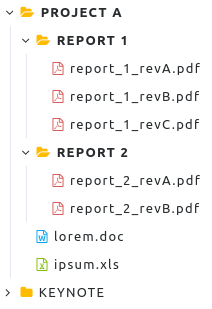
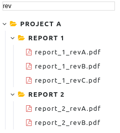
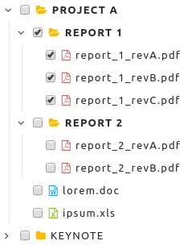

# elm-treeview

[](https://travis-ci.org/gribouille/elm-treeview)

A customizable ELM treeview component. 

[DEMOS](https://gribouille.github.io/demos/elm-treeview/latest/)


## Example

Basic example with defaut options:

```elm
import Html
import Treeview

styles : Styles
styles = 
  [ T.Style "folder" ("folder yellow", "folder-open yellow") ""
  , T.Style "archive" ("file-archive-o", "file-archive-o") ""
  , T.Style "word" ("file-word-o", "file-word-o") "blue"
  , T.Style "image" ("file-image-o", "file-image-o") ""
  , T.Style "pdf" ("file-pdf-o", "file-pdf-o") "red"
  , T.Style "powerpoint" ("file-powerpoint-o", "file-powerpoint-o") "orange"
  , T.Style "excel" ("file-excel-o", "file-excel-o") "green"
  ]

model : Model
model = 
  [ T.node "pA" "Project A" "folder" False <| Just [
      T.node "pAg1" "Report 1" "folder" False <| Just [
        T.node "pAg1f1" "report_1_revA.pdf" "pdf" True Nothing,
        T.node "pAg1f2" "report_1_revB.pdf" "pdf" True Nothing,
        T.node "pAg1f3" "report_1_revC.pdf" "pdf" True Nothing
      ],
      T.node "pAg2" "Report 2" "folder" False <| Just [
        T.node "pAg2f1" "report_2_revA.pdf" "pdf" True Nothing,
        T.node "pAg2f2" "report_2_revB.pdf" "pdf" True Nothing
      ],
      T.node "pAf1" "lorem.doc" "word" True Nothing,
      T.node "pAf2" "ipsum.xls" "excel" True Nothing
    ],
    T.node "pB" "Keynote" "folder" False <| Just [
      T.node "pBf1" "workshop_part1.ppt" "powerpoint" True Nothing,
      T.node "pBf2" "workshop_part2.ppt" "powerpoint" True Nothing,
      T.node "pBf3" "image1.png" "image" True Nothing,
      T.node "pBf4" "image2.ppt" "image" True Nothing,
      T.node "pBf5" "image3.ppt" "image" True Nothing,
      T.node "pBf5" "image4.ppt" "image" True Nothing
    ]
  ]

config : T.Config
config = T.default styles


main : Program Never T.Model T.Msg 
main =
  Html.beginnerProgram
    { model = model
    , view = T.view config
    , update = T.update 
    }
```

<p align="center"></p>


With search input:

```elm
config : T.Config
config = 
  let
    d = T.default styles
  in
    {d | search = { enable = True}}
```

<p align="center"></p>

With checkbox selection:

```elm
config : T.Config
config = 
  let
    d = T.default styles
  in
    {d | checkbox = { enable = True, multiple = True, cascade = True}}
```

<p align="center"></p>


## Theme

See the `treeview.scss` file in the `styles` folder to customize the theme.

## Options

| Name                | Type       | Default | Description                                                                                 |
| ------------------- | ---------- | ------- | ------------------------------------------------------------------------------------------- |
| `checkbox.enable`   | `Bool`     | `False` | Activate the checkbox selection for each node.                                              |
| `checkbox.multiple` | `Bool`     | `False` | Multiple nodes can be selected.                                                             |
| `checkbox.cascade`  | `Bool`     | `False` | Enable the cascading selection (the children node will selected if the parent is selected). |
| `search.enable`     | `Bool`     | `False` | Activate the search toolbar.                                                                |
| `sort`              | `Sort`     | `None`  | Sort the nodes: Asc = ascending, Desc = descending.                                         |
| `look.theme`   | `String`   | `""`    | Apply the theme.                                                                            |
| `look.styles`  | `[Styles]` | `[]`    | Define the styles (CSS class and icons) for nodes.                                          |

## Documentation

See documentation [here](http://package.elm-lang.org/packages/gribouille/elm-treeview/latest).

## Usage

To run the examples:
```shell
$ cd examples
$ npm i
$ npm run dev
```
Open [localhost:8080](http://localhost:8080).


## TODO
- [x] search toolbar
- [x] checkbox
- [ ] ajax
- [ ] interface for JS
- [ ] other themes 
- [ ] contextual menu
- [ ] unit test

## Contributing

Feedback and contributions are very welcome.


## License

This project is licensed under [MIT](./LICENSE).
